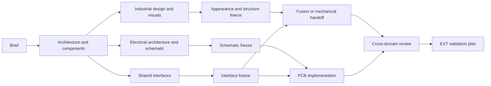

# Workflow V2

## Dependency graph

Independent branches may run in parallel. A node may start only when its required parents are frozen at the recorded revisions.

## Node contract

Each node declares:

- input artifact IDs and hashes
- required user decisions
- capability requirements
- output artifacts
- verification checks
- descendants to invalidate when the output changes

## Readiness gates

### Direction exploration

Require a normalized brief plus user-approved or user-provisionally-approved architecture and component envelopes. If image generation is skipped or unavailable, produce textual concept directions; do not force a render phase.

### Visual convergence

Run only when the user selected `image`, `video`, or `image+video`. Ask the user to select the direction and candidate. Require enough views to resolve the geometry needed downstream; otherwise mark missing views as blockers or explicit exceptions.

### Fusion modeling

Require an approved mechanical route, frozen appearance/structure revision, interface-control revision, acceptance checks, and a ready adapter or handoff path. The CAD loop ends when checks pass and the user freezes the model, or when blocked.

### Schematic

Require an approved schematic route, electrical requirements, critical component decisions, power/interface contracts, and validation checks. Freeze only with strict DRC evidence, critical-net endpoint evidence, and recorded exceptions.

### PCB

Require an approved PCB route, schematic freeze, shared-interface freeze, verified critical footprints and pin-pad mappings, board constraints, and a recovery path. Do not infer layer count, stack-up, connector orientation, or board outline.

### Cross-domain review

The machine-gated `cross_domain_checks` compares exactly five mandatory shared groups against one Interface Control revision: PCB thickness, mounting holes, connectors, height zones, and antenna keep-outs. Board outline, buttons, indicators, thermal/service keep-outs, battery/FPC/cable volumes, and enclosure openings remain mandatory domain checks or explicit acceptance evidence when present; do not claim the five-group record verified those additional items.

Interface Control is required for PCB even when `mechanical: skip`. In that case derive it from user-approved board and product-interface decisions without starting a CAD implementation branch.

## Resume protocol

1. Load `run-state.v2.json`.
2. Validate schema and referenced artifact hashes.
   Use the cross-document bundle validator before crossing a freeze or execution gate; a non-empty decision ID is not sufficient by itself.
3. Mark changed descendants stale.
4. Re-open any unresolved decision gate.
5. Resume the earliest ready node, not simply the earliest missing file.

## Failure behavior

Keep verified artifacts intact. Mark only the affected step or branch blocked. If direct execution fails, gather read-only evidence of partial application before proposing retry, rollback, guided work, hybrid ownership, handoff, or pause to the user.
